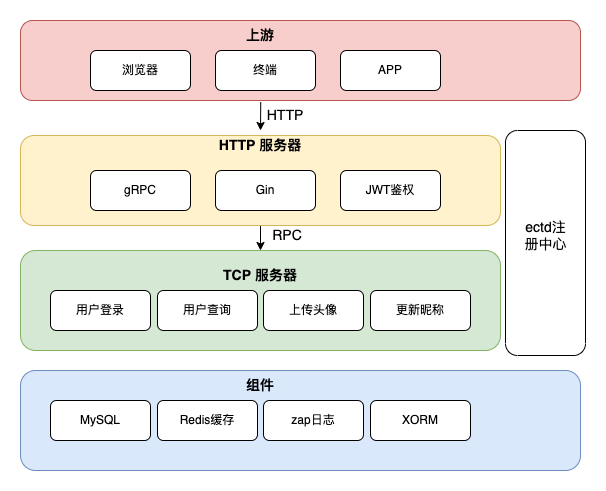
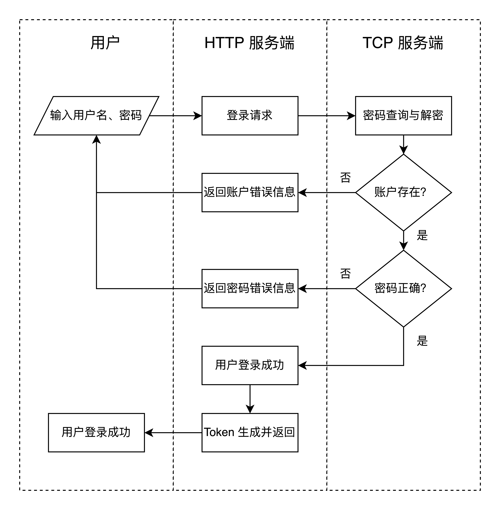
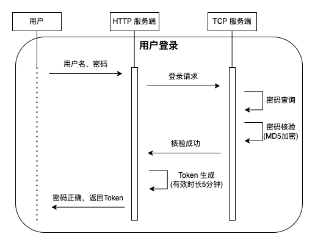
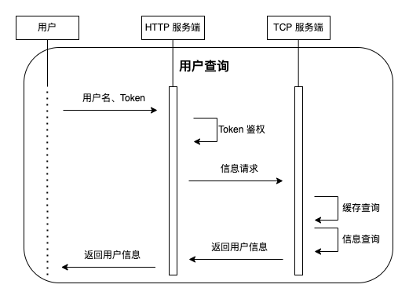
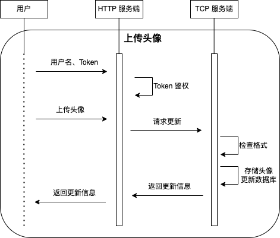
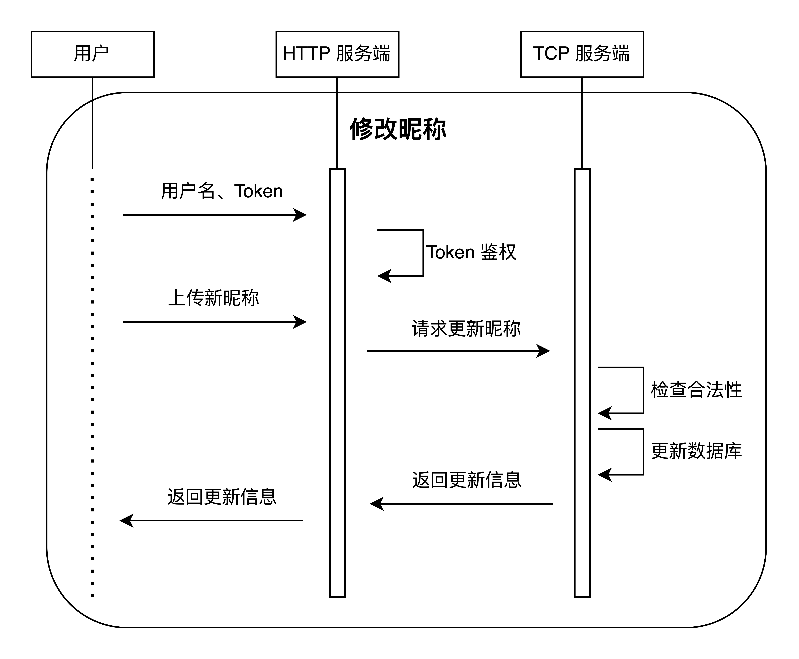

# entry task 项目设计方案

- [entry task 项目设计方案](#entry-task-项目设计方案)
  - [项目需求](#项目需求)
  - [架构设计](#架构设计)
  - [具体功能实现](#具体功能实现)
  - [数据库表设计](#数据库表设计)
  - [Web API 设计](#web-api-设计)

## 项目需求

实现一个用户管理系统，用户可以登录、拉取和编辑他们的 profiles。

用户可以通过在 Web 页面（Web页面不作为评分标准，可以简单处理或者用 postman 演示）输入 username 和 password 登录，backend 系统负责校验用户身份。成功登录后，页面需要展示用户的相关信息；否则页面展示相关错误。

成功登录后，用户可以编辑以下内容：

- 上传 profile picture
- 修改 nickname（需要支持Unicode字符集，utf-8编码）
- 用户信息包括：
  - username（不可更改）
  - nickname
  - profile picture

性能要求：

- 数据库数据库必须有10,000,000条用户账号信息
- 必须确保返回结果是正确的
- 每个请求都要包含RPC调用以及Mysql或Redis访问
- 200并发（固定用户）情况下，HTTP API QPS大于3000
- 200个client，每个client模拟一个用户（因此需要200个不同的固定用户账号）
- 200并发（随机用户）情况下，HTTP API QPS大于1000
- 200个client，每个client每次随机从10,000,000条记录中选取一个用户，发起请求（如果涉及到鉴权，可以使用一个测试用的token）
- 2000并发（固定用户）情况下，HTTP API QPS大于1500
- 2000并发（随机用户）情况下，HTTP API QPS大于800

## 架构设计

1、总体结构分为用户端，HTTP服务端，TCP服务端三个部分，所有逻辑功能使用RPC调用完成。  
2、使用 etcd 作为 gRPC 服务的注册中心。  
3、Token 鉴权过程在 HTTP 服务器内部完成。  
4、业务步骤大概可分为四步：  
（1）用户向 HTTP 服务器请求服务  
（2）HTTP 服务器通过 gRPC 请求 TCP 服务器提供的具体服务  
（3）TCP 服务器执行具体逻辑，并向 HTTP 服务器返回服务响应  
（4）HTTP 服务器向用户返回服务响应  

## 具体功能实现

- 用户登录

用户登录步骤分为四步：  
（1）用户向 HTTP 服务器请求登录服务  
（2）HTTP 服务器通过 RPC 调用 TCP 服务器的登录验证服务  
（3）TCP 服务器核验密码，并向 HTTP 返回核验结果  
（4）HTTP 服务器生成 Token 并随同用户登录信息一起返回  

- 用户查询

用户查询步骤分为五步：  
（1）用户向 HTTP 服务器请求信息查询服务  
（2）HTTP 服务器鉴定用户 Token 有效性  
（3）HTTP 通过 gRPC 请求 TCP 服务器的查询服务  
（4）TCP 服务器查询数据库并向 HTTP 服务器返回查询信息  
（5）HTTP 服务器向用户返回查询信息  

- 上传 profile picture

上传头像步骤分为五步：  
（1）用户向 HTTP 服务器请求上传服务  
（2）HTTP 服务器鉴定用户 Token 有效性  
（3）HTTP 通过 gRPC 请求 TCP 服务器的上传头像服务  
（4）TCP 服务器验证上传文件合法性、更新数据库并向 HTTP 服务器返回更新后信息  
（5）HTTP 服务器向用户返回更新后的用户信息  

- 修改昵称

修改昵称步骤分为五步：
（1）用户向 HTTP 服务器请求修改昵称服务  
（2）HTTP 服务器鉴定用户 Token 有效性  
（3）HTTP 通过 gRPC 请求 TCP 服务器的修改昵称服务  
（4）TCP 服务器验证昵称合法性、更新数据库并向 HTTP 服务器返回更新后信息  
（5）HTTP 服务器向用户返回更新后的用户信息  

## 数据库表设计

|字段|类型|属性|注释|
|-|-|-|-|
|id|bigint unsigned| PRI| auto_increment|
|name|varchar(64) | UNI| |
|nickname|varchar(64) |not null| |
|password|varchar(32)| not null| encrypted password |
|profile_pic_url|varchar(1024)| not null| url of profile picture |
|ctime|datetime| not null| creat time |
|mtime|datetime| not null| modified time |

## Web API 设计

- 用户登录

  - 定义：使用该 API 来登录用户
  - 地址：`/login`
  - 方法：`HTTP(POST)`

  请求参数
  |参数|强制性|类型|描述|长度|
  |-|-|-|-|-|
  |username|是|string|用户名|6-64|
  |password|是|string|密码|6-64|

  返回参数
  |参数|强制性|类型|描述|
  |-|-|-|-|
  |retcode|是|int|返回码|
  |msg|是|string|返回码信息|
  |Token|是|string|鉴权 Token|

- 用户查询
  
  - 定义：使用该 API 来查询用户信息
  - 地址：`/query`
  - 方法：`HTTP(GET)`

  请求参数
  |参数|强制性|类型|描述|长度|
  |-|-|-|-|-|
  |username|是|string|用户名|6-64|
  |Token|是|string|用户Token||

  返回参数
  |参数|强制性|类型|描述|
  |-|-|-|-|
  |retcode|是|int|返回码|
  |msg|是|string|返回码信息|
  |data|是|object|用户信息结构|
  |username|是|string|用户名|
  |nickname|是|string|用户昵称|
  |profile_pic|是|string|用户头像url|

- 上传头像
  
  - 定义：使用该 API 上传用户头像
  - 地址：`/upload-pic`
  - 方法：`HTTP(POST)`

  请求参数
  |参数|强制性|类型|描述|
  |-|-|-|-|
  |username|是|string|用户名|
  |Token|是|string|用户Token|
  |file|是|object|用户头像file|

  返回参数  
  |参数|强制性|类型|描述|
  |-|-|-|-|
  |retcode|是|int|错误码|
  |msg|是|string|错误码信息|
  |data|是|object||
  |profile_pic_url|是|string|返回更新头像url|

- 更新昵称
  
  - 定义：使用该 API 更新用户昵称
  - 地址：`/update-nickname`
  - 方法：`HTTP(POST)`

  请求参数
  |参数|强制性|类型|描述|
  |-|-|-|-|
  |username|是|string|用户名|
  |Token|是|string|用户Token|
  |nickname|是|string|用户新昵称|

  返回参数  
  |参数|强制性|类型|描述|
  |-|-|-|-|
  |retcode|是|int|错误码|
  |msg|是|string|错误码信息|
  |data|是|object||
  |nickname|是|string|返回用户昵称|

  返回码设计
  |返回码|描述|
  |-|-|
  |0|成功|
  |1000|服务器错误|
  |1001|非法参数|
  |1002|Not found|
  |2001|登录失败|
  |2002|Token 失效，重新登录|
  |3001|查询失败|
  |3002|更新昵称失败|
  |3003|上传头像失败|
  

